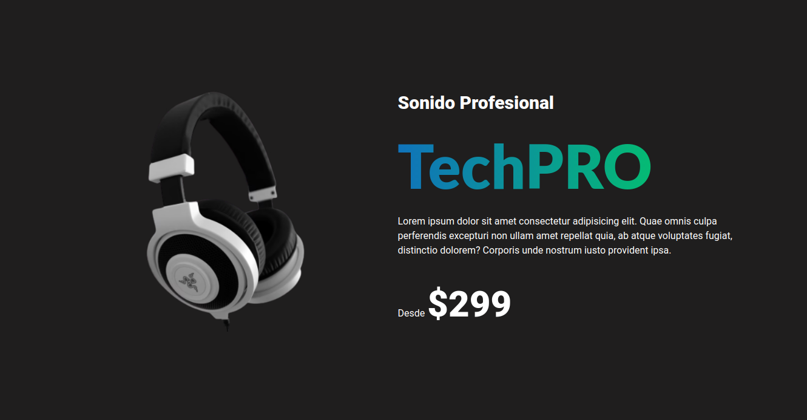
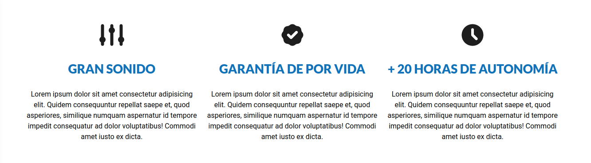
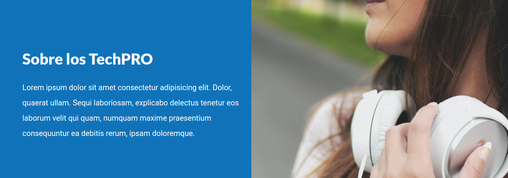

# TechPRO (landing page)






## Installation

### clone repo **(gh CLI)**
```
gh repo clone norbix14/css-techpro techpro
```

### go to folder
```
cd techpro
```

### run app
* double click on **index.html**
* open with **Live Server**
